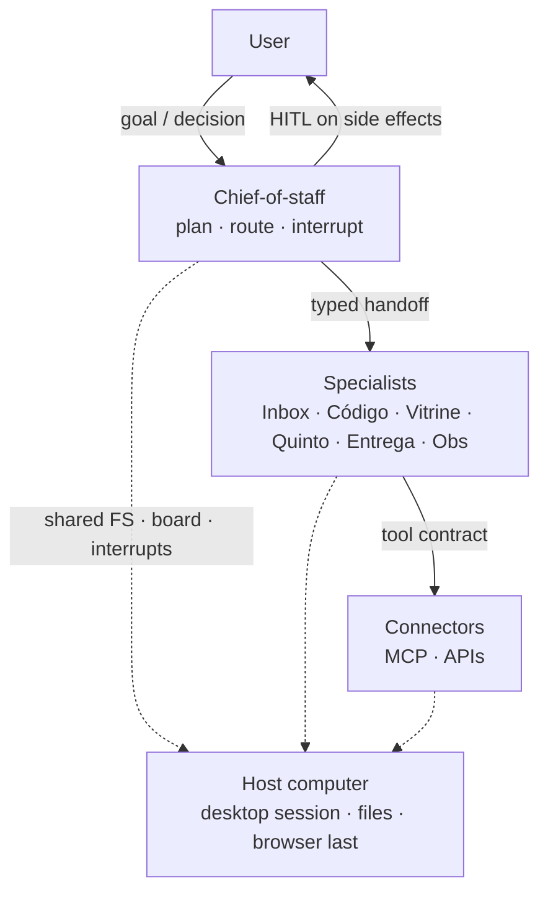

# Grok Bot Architecture

A **desktop / multi-agent assistant OS**: a crew of specialists, one shared computer, routines, connectors, and human gates. You already have a capable chat. This is the operating system around it — who owns the goal, who may write, what pauses, and what the machine is allowed to touch.

**PT:** Padrão de SO assistant (crew + computador compartilhado + HITL); Grok Bot / Cursor é o host de exemplo.

[Grok Bot](https://cursor.com) on Cursor is the **example host**. The layers stay vendor-agnostic — same idea as [jarvis-architecture](https://github.com/tiagovilasboas/jarvis-architecture) ADR 0003: hosts are examples, not the definition. Drop the pattern on another desktop harness and the crew contracts should still make sense.

Agent operating notes live in [`AGENTS.md`](AGENTS.md).

Maintainer: [Tiago Montanha](https://github.com/tiagovilasboas) · Staff · Agentic AI

---

## Why this exists

One desktop agent with every tool is a fun afternoon and a bad month. Inbox, code, storefront, money, ship, and observability do not belong in one context window. They collide on **secrets**, **write-boundary**, and **token budget**. The fix is not a bigger prompt. It is a crew, a shared computer, and fail-closed side effects.

This repo is the public reference — pattern first, product second. It is **not** the private Grok Bot workspace, not a system-prompt dump, and not a screenshot gallery.

## Pattern vs example host

| Layer | Meaning |
|---|---|
| **Pattern** | User → chief-of-staff → specialists → connectors, all on a host computer. Routines tick. HITL sits on irreversible writes. |
| **Example host** | Grok Bot (Cursor): desktop sessions, cloud agents for long code, MCP connectors. Replaceable. |

Example specialist names in this repo (`Inbox`, `Código`, `Vitrine`, `Quinto`, `Entrega`, `Obs`) are **pattern labels**, not product secrets. Rename them. Keep job · objective · write-boundary.

## Model

Full layering and trust boundaries: [`docs/architecture.md`](docs/architecture.md).

## Start here

1. [`docs/architecture.md`](docs/architecture.md) — layers and what sits on the shared computer.
2. [`docs/crew/roles.md`](docs/crew/roles.md) — who does what, and who may write.
3. [`docs/crew/hitl.md`](docs/crew/hitl.md) — what must pause.
4. [`docs/cookbook/first-week.md`](docs/cookbook/first-week.md) — stand up a thin crew without boiling the ocean.

Decision log: [`docs/adr/README.md`](docs/adr/README.md).

| ADR | Decision |
|---|---|
| [0001](docs/adr/0001-crew-of-agents.md) | Crew of specialists, not a monolith |
| [0002](docs/adr/0002-shared-computer-vs-desktop.md) | Shared computer ≠ “a desktop chat” |
| [0003](docs/adr/0003-hitl-on-side-effects.md) | Fail closed on merge / deploy / secrets / messaging-as-user |
| [0004](docs/adr/0004-connectors-over-browser.md) | Connectors over browser |
| [0005](docs/adr/0005-token-thrift.md) | Token thrift is a control, not a vibe |
| [0006](docs/adr/0006-cloud-agents-for-code.md) | Cloud agents for isolated code work |

## Related

Sister repos (do not paste their private trees here):

- [jarvis-architecture](https://github.com/tiagovilasboas/jarvis-architecture) — vendor-agnostic **brain · workers · ops**
- [kiro-crew](https://github.com/tiagovilasboas/kiro-crew) — IDE crew (Planner / Implementer / Reviewer / Ops)
- [awesome-agentic-ai](https://github.com/tiagovilasboas/awesome-agentic-ai) — curated MCP / HITL / AppSec
- [agent-measurement](https://github.com/tiagovilasboas/agent-measurement) — measure the loop
- [agentic-code-review](https://github.com/tiagovilasboas/agentic-code-review) — review skills and guardrails

Public pattern refs (not dependencies): [MCP](https://modelcontextprotocol.io/docs/learn/architecture) · [Anthropic — effective agents](https://www.anthropic.com/engineering/building-effective-agents) · [LangGraph HITL](https://docs.langchain.com/oss/python/langgraph/interrupts) · [OTel GenAI](https://opentelemetry.io/docs/specs/semconv/gen-ai/) · [OWASP agentic](https://genai.owasp.org/resource/owasp-top-10-for-agentic-applications-for-2026/) · [AGENTS.md](https://agents.md/) · [12-factor agents](https://github.com/humanlayer/12-factor-agents)

## Contributing

See [`CONTRIBUTING.md`](CONTRIBUTING.md). One decision per ADR. No vendor lock-in in the contracts.

## License

[MIT](LICENSE)
