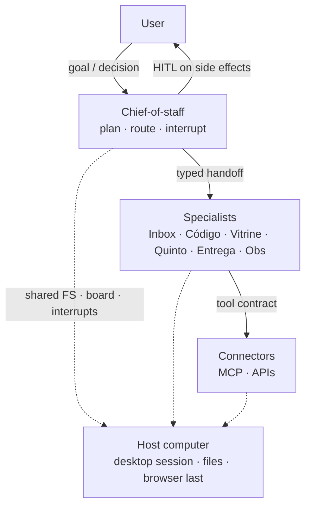

# Grok Bot Architecture

**Decision this repo helps you make:** whether a desktop assistant should be a **crew on a shared computer** — typed handoffs, fail-closed HITL, connectors over the browser, token thrift — or a single chat with every tool.

Staff ADRs and crew contracts. The proof is the validators, not a product CLI.

```text
node scripts/validate-all.mjs
```

Broken fixtures under `examples/*.broken.json` must be **rejected**. Fixed fixtures must be **accepted**. CI runs the same command (and the two checkers it wraps).

### Sample pass

```text
self-test: OK
examples/handoff.broken.json: REJECTED (expected)
  - done_when must be a non-empty string
  - from must be a role, not "the agent"
  - refs must be an array of pointers (paths, SHAs, issue ids, URLs — not a transcript blob)
  - write_policy must be read | draft | hitl:<merge|deploy|secrets|messaging-as-user> | allowlist:<name>
  - decision / decided_by belong on the interrupt record; do not invent a resume on the hop
examples/handoff.fixed.json: ACCEPTED (expected)
OK
self-test: OK
examples/interrupt.broken.json: REJECTED (expected)
  - gate must be one of merge, deploy, secrets, messaging-as-user (got undefined)
  - default_on_timeout must be "wait" (got "approve")
  - decided_by must be a human identifier; never invent a specialist or model
examples/interrupt.fixed.json: ACCEPTED (expected)
OK
```

### Sample fail

A broken fixture the checker accepts (or a fixed fixture it rejects) fails the run:

```text
examples/handoff.broken.json: ACCEPTED (expected REJECTED)
Handoff fixture expectations failed.
```

That is the contract: ghost owners, transcript `refs`, invented `decision`, and `default_on_timeout: approve` do not ship.

Maintainer: [Tiago Montanha](https://github.com/tiagovilasboas) · Staff · Agentic AI

## Architecture



| Layer | Meaning |
|---|---|
| **Pattern** | User → chief-of-staff → specialists → connectors on one host computer |
| **Example host** | Grok Bot (Cursor). Replaceable. Layers stay vendor-agnostic. |

Layers and trust boundaries: [`docs/architecture.md`](docs/architecture.md) · ADRs: [`docs/adr/README.md`](docs/adr/README.md)

| ADR | Decision |
|---|---|
| [0001](docs/adr/0001-crew-of-agents.md) | Crew of specialists, not a monolith |
| [0002](docs/adr/0002-shared-computer-vs-desktop.md) | Shared computer ≠ “a desktop chat” |
| [0003](docs/adr/0003-hitl-on-side-effects.md) | Fail closed on merge / deploy / secrets / messaging-as-user |
| [0004](docs/adr/0004-connectors-over-browser.md) | Connectors over browser |
| [0005](docs/adr/0005-token-thrift.md) | Token thrift is a control |
| [0006](docs/adr/0006-cloud-agents-for-code.md) | Cloud agents for isolated code work |

## Crew

Example names (`Inbox`, `Código`, `Vitrine`, `Quinto`, `Entrega`, `Obs`) are **pattern labels**. Keep job · objective · write-boundary.

| Role | Job | Writes |
|---|---|---|
| **Chief-of-staff** | Plan, route, interrupt | Board + interrupts |
| **Inbox** | Triage inbound | Drafts; send-as-user → HITL |
| **Código** | Repo change in scope | Branch / cloud PR; merge → HITL |
| **Vitrine** | Public surface | Draft / PR; publish → HITL |
| **Quinto** | Finance close | Ledger drafts; pay → HITL |
| **Entrega** | Package and ship | Staging; deploy → HITL |
| **Obs** | Traces / evals | Notes; mute prod → HITL |

[`docs/crew/roles.md`](docs/crew/roles.md) · [`handoffs.md`](docs/crew/handoffs.md) · [`hitl.md`](docs/crew/hitl.md)

Machine-checked envelopes: [`examples/`](examples/) · `node scripts/validate-handoff.mjs` · `node scripts/validate-interrupt.mjs` · `node scripts/validate-all.mjs`.

## When to use this pattern

Use this log when you are standing up a **desktop multi-agent assistant OS** and need the decisions (crew, shared computer, HITL, connectors, thrift) in one place. Skip it when one human, one repo, one chat is enough — a crew is ceremony.

Short filter: [`docs/cookbook/when-to-use-this-pattern.md`](docs/cookbook/when-to-use-this-pattern.md).

## Start

| # | Read | Why |
|---|---|---|
| 1 | [`docs/architecture.md`](docs/architecture.md) | Layers and trust |
| 2 | [`docs/adr/README.md`](docs/adr/README.md) | Accepted decisions (0001–0006) |
| 3 | [`docs/crew/roles.md`](docs/crew/roles.md) · [`handoffs.md`](docs/crew/handoffs.md) · [`hitl.md`](docs/crew/hitl.md) | Job · objective · write-boundary |
| 4 | [`docs/cookbook/first-week.md`](docs/cookbook/first-week.md) · [`failure-modes.md`](docs/cookbook/failure-modes.md) | Stand up; then loops that look fast and go wrong |
| 5 | [`docs/context-engineering.md`](docs/context-engineering.md) | What enters the window; thrift; fail-closed |

Then: [`routines.md`](docs/routines.md) · [`connectors.md`](docs/connectors.md) · [`security.md`](docs/security.md) · [`token-economy.md`](docs/token-economy.md).

## Pattern refs

External patterns, not SDKs and not a sibling farm:

- [MCP architecture](https://modelcontextprotocol.io/docs/learn/architecture)
- [Anthropic — building effective agents](https://www.anthropic.com/engineering/building-effective-agents)
- [Anthropic — effective context engineering](https://www.anthropic.com/engineering/effective-context-engineering-for-ai-agents)
- [LangGraph HITL](https://docs.langchain.com/oss/python/langgraph/interrupts)
- [OWASP Top 10 for Agentic Applications (2026)](https://genai.owasp.org/resource/owasp-top-10-for-agentic-applications-for-2026/)
- [AGENTS.md](https://agents.md/)
- [12-factor agents](https://github.com/humanlayer/12-factor-agents)
- [OTel GenAI](https://opentelemetry.io/docs/specs/semconv/gen-ai/)

## Contributing

See [`CONTRIBUTING.md`](CONTRIBUTING.md).

## License

[MIT](LICENSE)

Agent notes: [`AGENTS.md`](AGENTS.md).
