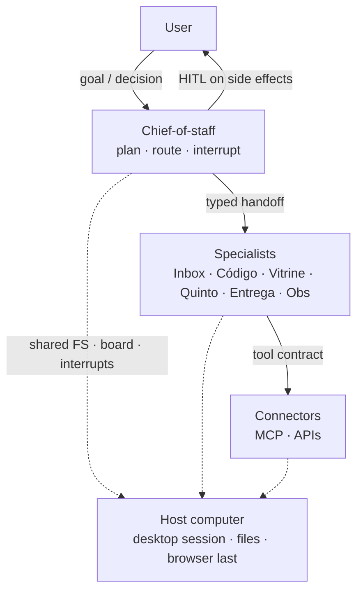

# Grok Bot Architecture

Desktop / multi-agent assistant OS: crew of specialists, shared computer, routines, connectors, HITL. Example host: [Grok Bot](https://cursor.com) (Cursor).

Padrão de SO assistant; Grok Bot / Cursor é o host de exemplo.

Maintainer: [Tiago Montanha](https://github.com/tiagovilasboas) · Staff · Agentic AI

## Architecture

| Layer | Meaning |
|---|---|
| **Pattern** | User → chief-of-staff → specialists → connectors on one host computer |
| **Example host** | Grok Bot (Cursor). Replaceable. Layers stay vendor-agnostic. |

Layers and trust boundaries: [`docs/architecture.md`](docs/architecture.md) · ADRs: [`docs/adr/README.md`](docs/adr/README.md)

| ADR | Decision |
|---|---|
| [0001](docs/adr/0001-crew-of-agents.md) | Crew of specialists, not a monolith |
| [0002](docs/adr/0002-shared-computer-vs-desktop.md) | Shared computer ≠ “a desktop chat” |
| [0003](docs/adr/0003-hitl-on-side-effects.md) | Fail closed on merge / deploy / secrets / messaging-as-user |
| [0004](docs/adr/0004-connectors-over-browser.md) | Connectors over browser |
| [0005](docs/adr/0005-token-thrift.md) | Token thrift is a control |
| [0006](docs/adr/0006-cloud-agents-for-code.md) | Cloud agents for isolated code work |

## Crew

Example names (`Inbox`, `Código`, `Vitrine`, `Quinto`, `Entrega`, `Obs`) are **pattern labels**. Keep job · objective · write-boundary.

| Role | Job | Writes |
|---|---|---|
| **Chief-of-staff** | Plan, route, interrupt | Board + interrupts |
| **Inbox** | Triage inbound | Drafts; send-as-user → HITL |
| **Código** | Repo change in scope | Branch / cloud PR; merge → HITL |
| **Vitrine** | Public surface | Draft / PR; publish → HITL |
| **Quinto** | Finance close | Ledger drafts; pay → HITL |
| **Entrega** | Package and ship | Staging; deploy → HITL |
| **Obs** | Traces / evals | Notes; mute prod → HITL |

[`docs/crew/roles.md`](docs/crew/roles.md) · [`handoffs.md`](docs/crew/handoffs.md) · [`hitl.md`](docs/crew/hitl.md)

## Start

| # | Read | Why |
|---|---|---|
| 1 | [`docs/architecture.md`](docs/architecture.md) | Layers and trust |
| 2 | [`docs/adr/README.md`](docs/adr/README.md) | Accepted decisions (0001–0006) |
| 3 | [`docs/crew/roles.md`](docs/crew/roles.md) · [`handoffs.md`](docs/crew/handoffs.md) · [`hitl.md`](docs/crew/hitl.md) | Job · objective · write-boundary |
| 4 | [`docs/cookbook/first-week.md`](docs/cookbook/first-week.md) · [`failure-modes.md`](docs/cookbook/failure-modes.md) | Stand up; then loops that look fast and go wrong |
| 5 | [`docs/context-engineering.md`](docs/context-engineering.md) | What enters the window; thrift; fail-closed |

Then: [`routines.md`](docs/routines.md) · [`connectors.md`](docs/connectors.md) · [`security.md`](docs/security.md) · [`token-economy.md`](docs/token-economy.md).

## Related

Siblings are scoped kits — not this desktop OS.

- [jarvis-architecture](https://github.com/tiagovilasboas/jarvis-architecture) — Reference architecture: brain · workers · ops. Swap the host, keep the domain.
- [kiro-crew](https://github.com/tiagovilasboas/kiro-crew) — Crew pattern: Planner → Implementer → Reviewer → Ops. Kiro is the example host.
- [awesome-agentic-ai](https://github.com/tiagovilasboas/awesome-agentic-ai) — Curated list: MCP · harness · AppSec. Decision filter, not a catalog.
- [agent-measurement](https://github.com/tiagovilasboas/agent-measurement) — Evals: suites, named metrics, reports. Measure; do not train.
- [agentic-code-review](https://github.com/tiagovilasboas/agentic-code-review) — AppSec PR review: skills, runbooks, `path:line` or silence.

Pattern refs: [MCP](https://modelcontextprotocol.io/docs/learn/architecture) · [Anthropic — effective agents](https://www.anthropic.com/engineering/building-effective-agents) · [Anthropic — context engineering](https://www.anthropic.com/engineering/effective-context-engineering-for-ai-agents) · [LangGraph HITL](https://docs.langchain.com/oss/python/langgraph/interrupts) · [OTel GenAI](https://opentelemetry.io/docs/specs/semconv/gen-ai/) · [OWASP agentic](https://genai.owasp.org/resource/owasp-top-10-for-agentic-applications-for-2026/) · [AGENTS.md](https://agents.md/) · [12-factor agents](https://github.com/humanlayer/12-factor-agents)

## Contributing

See [`CONTRIBUTING.md`](CONTRIBUTING.md).

## License

[MIT](LICENSE)

Agent notes: [`AGENTS.md`](AGENTS.md).
