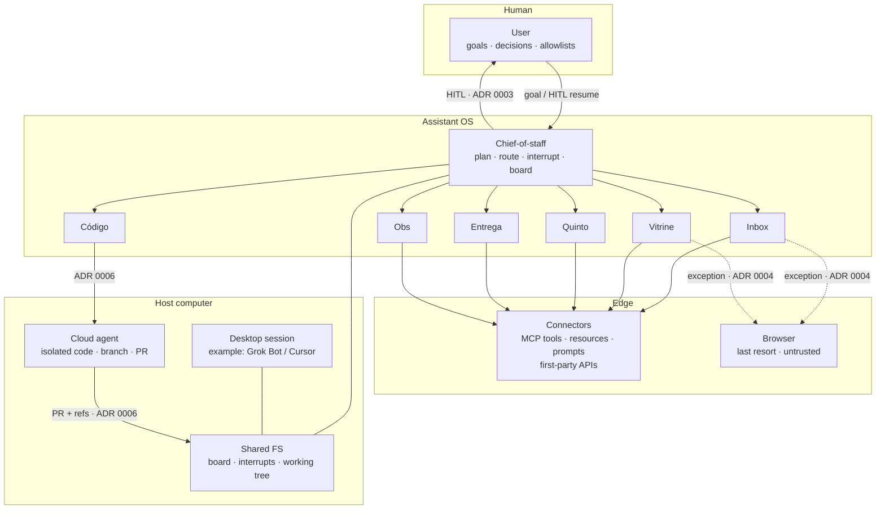

# Architecture

This is the operating system, not the chat product. Layers are portable. Grok Bot (Cursor) is one host mapping.

## Layers

**Diagram ↔ ADR** — the picture is the map; the records are the decisions.

| On the diagram | Decision |
|---|---|
| CoS → specialists (crew, not a monolith) | [ADR 0001](adr/0001-crew-of-agents.md) |
| Desktop session · Shared FS (computer ≠ chat) | [ADR 0002](adr/0002-shared-computer-vs-desktop.md) |
| User ↔ CoS (`goal / HITL resume`, `HITL`) | [ADR 0003](adr/0003-hitl-on-side-effects.md) |
| Specialists → Connectors; Browser `exception` | [ADR 0004](adr/0004-connectors-over-browser.md) |
| Hops as refs, not blobs (envelope, not drawn) | [ADR 0005](adr/0005-token-thrift.md) |
| Código → Cloud; Cloud → Files (`PR + refs`) | [ADR 0006](adr/0006-cloud-agents-for-code.md) |

Index: [adr/README.md](adr/README.md). When the loop feels fast and wrong: [cookbook/failure-modes.md](cookbook/failure-modes.md).

| Layer | Owns | Must not |
|---|---|---|
| **User** | Goals, allowlists, resume of privileged writes | Be impersonated |
| **Chief-of-staff** | Plan, route, board, interrupt records | Hold every connector secret; ship as the user |
| **Specialists** | One job, one write-boundary | Silent hops; extra tools “just in case” |
| **Connectors** | Schema’d tools and resources | Become the architecture; dump the catalog into context |
| **Host computer** | Session, FS, optional cloud machine | Be confused with the OS (see [ADR 0002](adr/0002-shared-computer-vs-desktop.md)) |

Vendor-agnostic rule: if you swap the example host (Grok Bot / Cursor) for another desktop harness, the table above still holds. Only the **mapping** (where the board file lives, how MCP is attached, how a cloud job is spawned) changes. That is the same honesty as [jarvis-architecture ADR 0003](https://github.com/tiagovilasboas/jarvis-architecture/blob/main/docs/adr/0003-vendor-agnostic.md), applied to a living assistant instead of a brain · workers · ops runtime.

## Shared computer

The crew shares **one computer**, not one context window:

- **Board** — current goals and hops (`examples/board.example.md` is the filled shape).
- **Interrupt records** — paused writes (`examples/interrupt-record.example.md`).
- **Working tree** — code and docs the specialists are allowed to touch.
- **Connector config** — which MCP/API servers exist; credentials stay in the host secret store, not in the chief-of-staff prompt.

Desktop chat is the **keyboard**. Cloud agents are **extra rooms** for long code ([ADR 0006](adr/0006-cloud-agents-for-code.md)). Neither replaces the board.

## Trust boundaries

Draw these before adding a tool:

1. **User identity** — messaging-as-user, payments, merge rights.
2. **Private data** — mail, finance, customer PII, deploy secrets.
3. **Untrusted content** — inbound mail, web pages, issue text, MCP resource bodies.
4. **Exfil channels** — any connector that can send, write remote, or call the network.

If a specialist can see (2) and (3) and reach (4), you have the [lethal trifecta](https://simonwillison.net/2025/Jun/16/the-lethal-trifecta/). Drop a leg or put HITL on the send. Details: [security.md](security.md).

## Control flow (happy path)

1. User states a one-sentence goal.
2. Chief-of-staff writes a board card: owner, done-when, write-policy, refs.
3. Specialist works **only** that card. Tools come from its connector allowlist.
4. Handoff is a typed envelope ([crew/handoffs.md](crew/handoffs.md)), not a transcript paste.
5. Privileged write → interrupt → human `decision` ([crew/hitl.md](crew/hitl.md)).
6. Obs records outcome (trace id, tokens if known, residual risk). No invented prod numbers.

Routines are the same loop on a schedule ([routines.md](routines.md)).

## What this is not

- Not [kiro-crew](https://github.com/tiagovilasboas/kiro-crew) (Planner → Implementer → Reviewer → Ops; Kiro is the example host). That crew reviews and ships code in an editor. This OS sits on a **desktop computer** and includes inbox, storefront, money, and ship.
- Not [jarvis-architecture](https://github.com/tiagovilasboas/jarvis-architecture) (brain · workers · ops). Jarvis is the reference architecture for swapping a host. This repo is the **living assistant** on one shared computer.
- Not the sibling kits: [awesome-agentic-ai](https://github.com/tiagovilasboas/awesome-agentic-ai) (curated list), [agent-measurement](https://github.com/tiagovilasboas/agent-measurement) (evals), [agentic-code-review](https://github.com/tiagovilasboas/agentic-code-review) (AppSec `path:line`).
- Not a private prompt pack. If a sentence only works as a secret system prompt, it does not belong here.

## Public refs (patterns, not SDKs)

- [MCP architecture](https://modelcontextprotocol.io/docs/learn/architecture) — host / client / server
- [Building effective agents](https://www.anthropic.com/engineering/building-effective-agents) — orchestrator–workers, when not to add agents
- [12-factor agents](https://github.com/humanlayer/12-factor-agents) — own context and pause/resume
- [AGENTS.md](https://agents.md/) — in-repo agent SoT
- [LangGraph interrupts](https://docs.langchain.com/oss/python/langgraph/interrupts) — persist + resume
- [OTel GenAI](https://opentelemetry.io/docs/specs/semconv/gen-ai/) — portable spans
- [OWASP Top 10 for Agentic Applications (2026)](https://genai.owasp.org/resource/owasp-top-10-for-agentic-applications-for-2026/)
